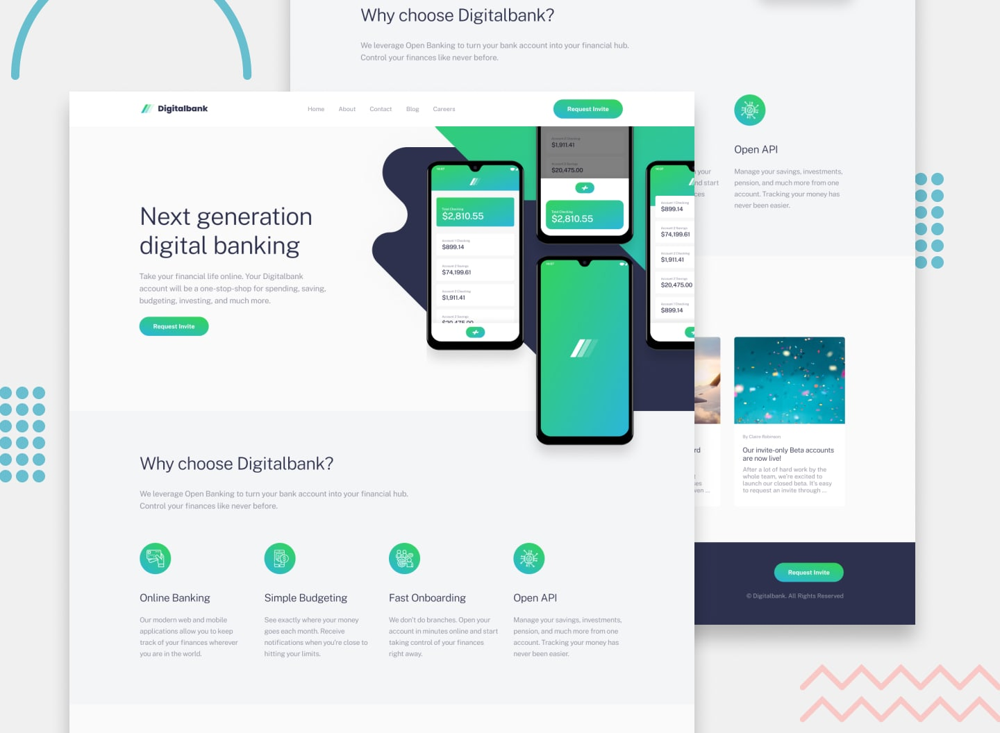

## Welcome! 👋

# Landing Page Project

A responsive and interactive landing page built with **HTML**, **CSS**, and **JavaScript**.  
It includes smooth navigation, animated hamburger menu, scroll animations, and an interactive "Back to Top" button.

## Live Demo

[🔗 View Demo](#)

---

## ✨ Features

- **Responsive Design** — Works perfectly on mobile, tablet, and desktop screens.
- **Animated Hamburger Menu** — Opens with a smooth animation and transforms into an "X".
- **Smooth Scroll Navigation** — Click any menu link to scroll smoothly to the target section.
- **Click Outside to Close Menu** — Menu closes when clicking outside or on a link.
- **Back to Top Button** — Appears after scrolling down, with smooth scroll to top.
- **Lazy Loading Images** — Improves loading speed by loading off-screen images only when needed.
- **Optimized Images** — Supports modern formats like WebP or AVIF for faster performance.
- **Scroll Animations** — Sections like features and articles fade/slide in as they enter the viewport.

---

## 📸 Preview



---

## 🛠️ Technologies Used

- **HTML5**
- **CSS3** (Flexbox, Media Queries, Animations)
- **JavaScript** (DOM manipulation, Event listeners)

---

## 🚀 How to Use

1. Clone the repository:
   ```bash
   git clone https://github.com/yourusername/your-repo-name.git
   ```
